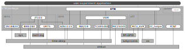

# ETB - Python Library

One strength of the *ETB* is its rich and easily accessible set of functionalities.
While the hardware modules could also be controlled by other languages, we decided to use Python (specifically Python 3) for our purposes due to its widespread use and the availability of supportive libraries.
In the following, the preparation of the Raspberry Pi (in the following shortly named *RPi*), the installation of the required packages, and the use of the *ETB* library are presented.
However, you can access the RPi either locally if you have the graphical desktop environment installed, or remotely via [SSH](https://www.raspberrypi.org/documentation/remote-access/ssh/unix.md).
For the latter, make sure you have the SSH server enabled (see [here](https://www.raspberrypi.org/documentation/remote-access/ssh/)).

The *ETB* library provides:
* control over operational parameters such as supply voltage (and ambient temperature; see below)
* collection of DUT responses
* data storage (database or [CSV](https://docs.python.org/3/library/csv.html))
* data analysis (using [numpy](https://numpy.org/) and [scipy](https://www.scipy.org/))
* data visualization (using [matplotlib](https://matplotlib.org/))

For the future, also a web interface to facilitate the (remote) access even further is planned.

---
## Content

1. [Raspberry Pi Preparation](#raspberry-pi-preparation)
    * [Activate OWI Interface](#activate-owi-interface)
    * [Activate TWI Interface](#activate-twi-interface)
    * [Activate UART interface](#activate-uart-interface)
2. [Python Dependencies](#python-dependencies)
3. [Additional Software](#additional-software)
    * [Database Server](#database-server)
        * [Install MariaDB](#install-mariadb)
        * [Install PhpMyAdmin](#install-phpmyadmin)
        * [Prepare Databases](#prepare-databases)
    * [DHCP Server on LAN](#dhcp-server-on-lan)
4. [ETB Library Usage](#etb-library-usage)

---


## Raspberry Pi Preparation

The RPi provides hardware support for several communication interfaces.
In our case, we use the one-wire interface (OWI) for the DS18B20 temperature sensor, the two-wire interface (TWI) for the ADC, the DC/DC converter, and the wattmeter as well as the universal asynchronous receiver-transmitter (UART) to directly communicate with the DUT.
The setup of these interfaces on the RPi is described below.

### Activate OWI Interface

Follow these steps to enable the one-wire interface (OWI), see also [here](https://www.circuitbasics.com/raspberry-pi-ds18b20-temperature-sensor-tutorial/):
* To activate the required [DT overlay (DTO)](https://www.raspberrypi.org/documentation/configuration/device-tree.md), enter
    `sudo nano /boot/config.txt`
    and add this to the bottom of the file:
    `dtoverlay=w1-gpio`
* Save and exit the editor; then reboot the Pi, e.g. with `sudo reboot`
* Log in to the RPi again and at the command prompt enter:
    `sudo modprobe wire`
    `sudo modprobe w1-gpio`
    `sudo modprobe w1-therm`
* You can check whether the modules are loaded with:
    `sudo lsmod`

To enable access to the DS18B20 temperature sensor:
* Change the working directory to `/sys/bus/w1/devices` by entering:
    `cd /sys/bus/w1/devices`
* Now enter `ls` to list the devices.
    For example, `28-011927fdb603 w1_bus_master1` will be displayed.
* Now enter `cd 28-011927fdb603`
    (or whatever address the sensor has on your system)
* Enter `cat w1_slave` which will show the raw temperature reading output by the sensor, where the temperature reading is `t=28625`, which means a temperature of 28.625 degrees Celsius.
* You will need to check and adjust the sensor's serial (e.g., 28-xxx) in the Python scripts (will be explained later).

### Activate TWI interface

Follow these steps to enable the two-wire interface (TWI), respectively the inter-integrated circuit (I2C) interface (see also [here](https://learn.adafruit.com/adafruit-stemma-soil-sensor-i2c-capacitive-moisture-sensor/python-circuitpython-test)):
* Log in to the RPi and enter:
    `sudo raspi-config`
    * Under `Interfacing Options` select `P5 I2C`
    * Confirm enabling the I2C module
* To check if an I2C device is available, enter:
    `sudo i2cdetect -y 1`
    You will see at which address devices are available (e.g., `48` for the ADS1115 ADC)

### Activate UART interface

Follow these steps to enable the UART interface (see also [here](https://www.electronicwings.com/raspberry-pi/raspberry-pi-uart-communication-using-python-and-c), [here](https://www.raspberrypi.org/documentation/configuration/uart.md) and [here](https://buyzero.de/blogs/news/praktische-kommunikation-per-uart-und-rs485-am-raspberry-pi):
* Log in to the RPi and execute:
    `sudo raspi-config`
    * Under `Interfacing Options` select `P6 Serial`
    * Confirm disabling the serial access to the login shell
    * Confirm enabling the serial port hardware
* For the RPi 3|4, we have to deactivate the Bluetooth (BT) interface (which uses the serial interface by default):
    `sudo systemctl disable hciuart`
* Last but not least, we need to select the right [DTO](https://www.raspberrypi.org/documentation/configuration/device-tree.md):
    `sudo nano /boot/config.txt`
    Add at the end (there should be `enable_uart=1` now):
    `dtoverlay=pi3-disable-bt`
* After that, the RPi needs to be rebooted:
    `sudo reboot`

---


## Python Dependencies

Dependency graph:


The test node runs python scripts and uses the raspberry's GPIOs, the one-wire interface, and the two-wire interface (I2C).
For this purpose the following libraries are needed:

* Python 3:
    `sudo apt install python3-pip python3-dev`
* I2C:
    `sudo apt install i2c-tools python3-smbus`
* MySQL:
    `sudo apt install default-libmysqlclient-dev`
    `python3 -m pip install mysql-connector-python`
* Zigbee:
    `python3 -m pip install digi-xbee`
* Matplotlib:
    `sudo apt install python3-tk libatlas-base-dev libopenjp2-7-dev`
    `python3 -m pip install matplotlib numpy scipy`

---


## Additional Software

### Database Server

#### Install MariaDB

The installation mainly follows the guide provided [here](https://pimylifeup.com/raspberry-pi-mysql/).
* Update our package list:
  `sudo apt update`
* Install the MariaDB (MySQL) server package:
  `sudo apt install mariadb-server`
* Secure the installation:
  `sudo mysql_secure_installation`
    * Set the root password:
      `$passWD$`
* Test the access:
  `sudo mysql -u root -p`

#### Install PhpMyAdmin

* Install <a href="https://www.phpmyadmin.net/" target="_blank">`phpMyAdmin`</a>:
  `sudo apt install phpmyadmin`
    * During the installation, <a href="https://www.phpmyadmin.net/" target="_blank">`phpMyAdmin`</a> will walk you through a basic configuration:
        * Select `Apache2` for the server
        * Choose `YES` when asked about whether to Configure the database for phpmyadmin with `dbconfig-common`
        * Enter your `MySQL` password when prompted:
          `$passWD$`
        * Enter the password that you want to use to log into phpMyAdmin:
          `$passWD$`
* Finish Installation:
  In MySQL 5.7 (released Oct 2015) and MySQL 8, the root MySQL user is set to authenticate using the auth_socket or caching_sha2_password plugin rather than with mysql_native_password. This will prevent programs like phpMyAdmin from logging in with the root account.
    * Enable remote `mysql` access:
      `sudo nano /etc/mysql/mariadb.conf.d/50-server.cnf`
        * Comment the line with:
          `#bind-address=127.0.0.1`
        * Save config file (`CTRL+O` and `CTRL+X`)
    * Create a New Superuser for phpMyAdmin:
        * Open up the MySQL prompt from your terminal:
          `sudo mysql -p -u root`
        * Create a new superuser (with local access only):
          `CREATE USER 'admin'@'localhost' IDENTIFIED BY '$passWD$';`
          `GRANT ALL PRIVILEGES ON *.* TO 'admin'@'localhost' WITH GRANT OPTION;`
          `FLUSH PRIVILEGES;`
    * Restart the `mysql` service:
      `sudo /etc/init.d/mysql restart`
    * Now <a href="http://10.0.0.43/phpmyadmin/" target="_blank">`phpMyAdmin`</a> is available on your system.
        * You can access phpmyadmin with the user `admin` and the previously set password.
* Additional Apache configuration:
    * Additionally PHP should be provided:
      `sudo apt install php php-mcrypt php-mysql`
    * Apache is running as user *www-data*, so make this user owner of html directory
      `sudo chown -R www-data:www-data /var/www/html`
    * Add user *pi* to this group:
      `sudo usermod -a -G www-data pi`
    * Change html directory rights to enable write access for user `pi`:
      `sudo chmod 775 /var/www/html/`
* Fix bugs in PHPMyAdmin:
    * Open the SQL.lib file:
      `sudo nano /usr/share/phpmyadmin/libraries/sql.lib.php`
        * Replace the line:
          ``((empty($analyzed_sql_results['select_expr']))``
          ``    || (count($analyzed_sql_results['select_expr'] == 1)``
          ``        && ($analyzed_sql_results['select_expr'][0] == '*')))``
          with:
          ``((empty($analyzed_sql_results['select_expr']))``
          ``    || (count($analyzed_sql_results['select_expr']) == 1)``
          ``        && ($analyzed_sql_results['select_expr'][0] == '*'))``
        * See also [here](https://devanswers.co/problem-php-7-2-phpmyadmin-warning-in-librariessql-count/)

#### Prepare Databases

For the WSN testbed setup, we will use an own user for the DB access.

* Start MySQL:
  `sudo mysql -u root -p`
  * Enter previously set password
* Create an own user for the WSN testbed:
  `CREATE USER 'mywsn' IDENTIFIED BY '$passWD$';`
* Set the respective access rights:
  ``GRANT ALL ON `experiments`.* TO 'mywsn'@'%';``
  `FLUSH PRIVILEGES;`
* Exit MySQL:
  `quit`

Further configuration and setup of the databases are done via `PHPmyAdmin`.


### DHCP Server on LAN

Since some equipment like the climate chamber is connected via Ethernet, we need to activate the DHCP server on the raspberry.

* Install the `ISC DHCP server` (will initially fail, see below):
  `sudo apt install isc-dhcp-server`
* Select which interfaces shall use DHCP:
  `sudo nano /etc/default/isc-dhcp-server`
    * Add `eth0` to the IPv4 interfaces:
      `INTERFACESv4="eth0"`
* Several parameters must be activated and configured:
  `sudo nano /etc/dhcp/dhcpd.conf`
    * Besides the configuration template, the following lines are all we need:
```
option domain-name "raspberry.local";
option domain-name-servers 8.8.8.8, 4.4.4.4;

default-lease-time 600;
max-lease-time 7200;

# authoritative; # Is handled in the subnet definition

subnet 192.168.0.0 netmask 255.255.255.0 {
  authoritative;
  range 192.168.0.2 192.168.0.50;
  option subnet-mask 255.255.255.0;
  option routers 192.168.0.1;
  option broadcast-address 192.168.0.255;
}
```
* To configure the network interfaces, create a local config with:
  `sudo nano /etc/network/interfaces.d/locals`
    * We want to activate the DHCP server on the `eth0` interface:
```
auto lo
iface lo inet loopback

#auto wlan0
allow-hotplug wlan0
iface wlan0 inet dhcp
  wpa-conf /etc/wpa_supplicant/wpa_supplicant.conf

allow-hotplug eth0
iface eth0 inet static
  address 192.168.0.1
  netmask 255.255.255.0
```
* Now, bring eth0 down and up again:
  `sudo ifdown eth0` (may fail if its not up)
  `sudo ifup eth0`
* Start the DHCP server:
  `sudo service isc-dhcp-server start`
* Check the status of the DHCP server:
  `sudo systemctl status isc-dhcp-server.service`
* If we want to assign a static IP address to a device, we can add a block in the configuration:
  `sudo nano /etc/dhcp/dhcpd.conf`
    * Assume our device `climatechamber` has the MAC address `00:11:22:33:44:55`, then simply add the following lines to the subnet block:
```
    host climatechamber {
        hardware ethernet 00:11:22:33:44:55;
        fixed-address 192.168.0.4;
    }
```
