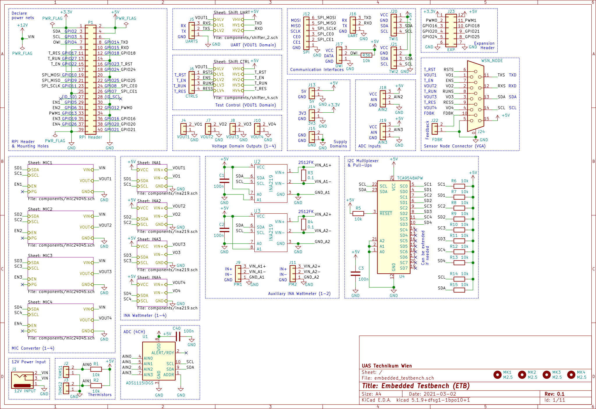
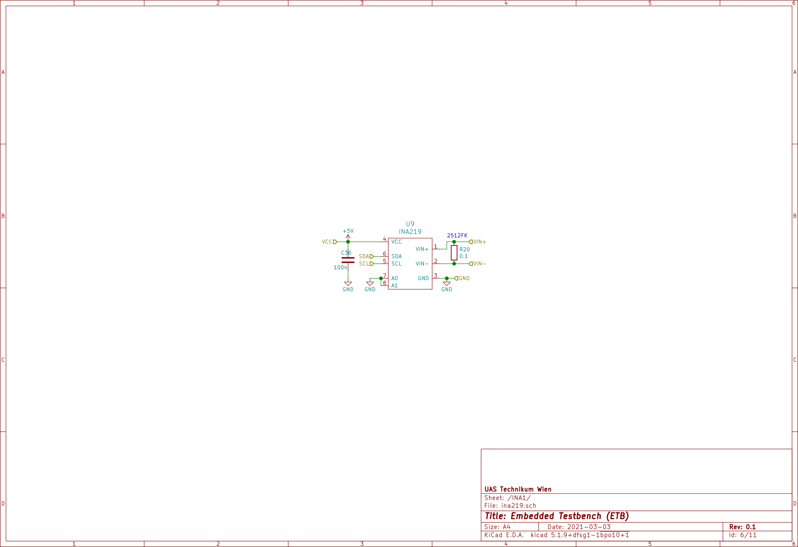
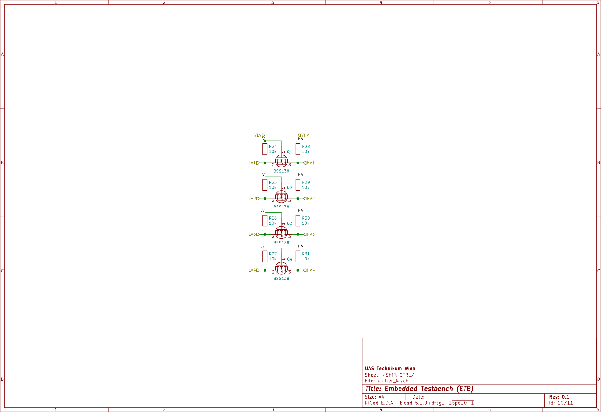
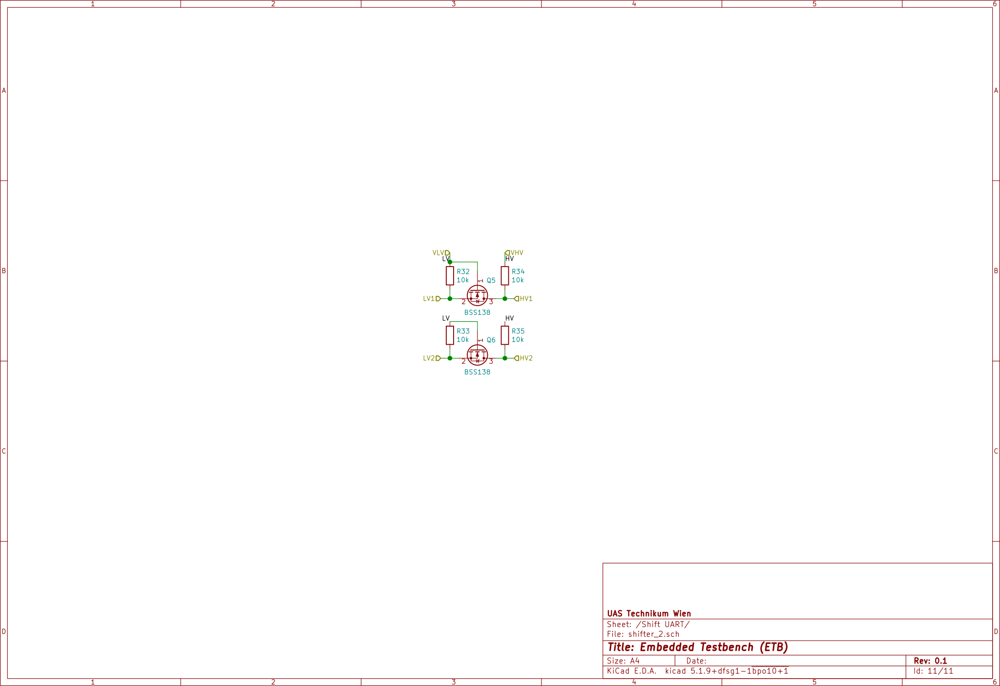

# ETB PCB Design

The board was designed with KiCad `version 5.1.9` and mainly uses schematic symbols and PCB footprints available via the [KiCad libraries](https://kicad.org/libraries/download/).
All parts not included in these libraries are available as project-specific libraries (see below).
It requires only a two-layer PCB with all components (except the expansion header) placed on the top side.
Also, it has enough ground zone area to avoid heating or EMI issues.


## Contents

```
kicad/
├── components                      : hierarchical schematic components
│   ├── ina219.sch                  : INA219-based wattmeter
│   ├── mic24045.sch                : MIC24045-based DC/DC converter
│   ├── shifter_2.sch               : MOSFET-based bi-directional level shifter (2 channel)
│   └── shifter_4.sch               : MOSFET-based bi-directional level shifter (4 channel)
├── myfootprint.pretty              : custom PCB footprints
│   ├── FQFN33-20LD-PL-1.kicad_mod  : FQFN33 footprint for MIC24045
│   └── L_Bourns-SRN5040.kicad_mod  : Bourns SRN5040 inductor footprint
├── embedded_testbench.kicad_pcb    : PCB layout file
├── embedded_testbench.lib          : schematic symbols library file
├── embedded_testbench.ods          : BOM (created with LibreOffice Calc version 7.1.1.2)
├── embedded_testbench.pro          : KiCad project file
├── embedded_testbench.sch          : schematic layout file
├── fp-lib-table                    : project-specific footprint library list
├── mycomponents.dcm                : custom schematic library (descriptions, aliases and keywords)
├── mycomponents.lib                : custom schematic library
└── sym-lib-table                   : project-specific symbol library list
```

## Costs

For the bill of materials (BOM) provided in the `.ods` file links to suitable components available at [Farnell](https://www.farnell.com/) are given including the prices valid at the time of the development (2021-03).
The cost of one *ETB* was around 53€ for the components ([Farnell](https://www.farnell.com/)) and around 15€ for the PCB ([PCB Pool / Beta Layout](https://eu.beta-layout.com/pcb/)).
Thus, the total costs of one *ETB* are below **70€**.
Depending on the supplier and quantities ordered, the costs may vary.


## Schematic

**Main schematic**:  


**Embedded hierarchical schematics**:  
* MIC24045 Schematic ([#1](../media/schematic/embedded_testbench-mic1.svg),[#2](../media/schematic/embedded_testbench-mic2.svg),[#3](../media/schematic/embedded_testbench-mic3.svg),[#4](../media/schematic/embedded_testbench-mic4.svg))  

* INA219 Schematic ([#1](../media/schematic/embedded_testbench-ina1.svg),[#2](../media/schematic/embedded_testbench-ina2.svg),[#3](../media/schematic/embedded_testbench-ina3.svg),[#4](../media/schematic/embedded_testbench-ina4.svg))  

* [CTRL shifter Schematic](../media/schematic/embedded_testbench-shifter_ctrl.svg)  

* [UART shifter Schematic](../media/schematic/embedded_testbench-shifter_uart.svg)  



## PCB Design

For the PCB design the following rules were used:
* Design rules:
    * Minimum track width: `0.15 mm`
    * Minimum via diameter: `0.6 mm`
    * Minimum via drill: `0.3 mm`
    * Minimum hole to hole: `0.25 mm`
    * `Prohibit overlapping courtyards`
* Tracks:
    * `0.2 mm`
    * `0.25 mm`
    * `0.4 mm`
    * `0.8 mm`
* Vias:
    * Size: `0.6 mm`
    * Drill: `0.3 mm`
* Zones:
    * Clearance: `0.3 mm`
    * Minimum width: `0.18 mm`
    * Pad connections: `Thermal reliefs`
    * Thermal clearance: `0.18 mm`
    * Thermal spoke width: `0.8 mm`


## Components/Libraries

If your installation of KiCad is missing (some of) the standard libraries, you can download them from [KiCad libraries](https://kicad.org/libraries/download/).
The custom libraries required are all contained in this repository.

### Schematic symbols

The following standard schematic symbol libraries are used:
* **Analog_ADC**
    * `ADS1115IDGS`
* **Connector**
    * `Barrel_Jack_Switch`
    * `DB15_Female_HighDensity_MountingHoles`
* **Connector_Generic**
    * `Conn_01x02`
    * `Conn_01x03`
    * `Conn_01x04`
    * `Conn_01x06`
    * `Conn_02x06_Counter_Clockwise`
    * `Conn_02x20_Odd_Even`
* **Device**
    * `C`
    * `CP1`
    * `L`
    * `R`
* **Interface_Expansion**
    * `TCA9548APWR`
* **Mechanical**
    * `MountingHole`
* **Transistor_FET**
    * `BSS138`

The following custom schematic symbol libraries are used:
* **mycomponents**
    * `INA219`
    * `MIC24045`

### PCB footprints

The following standard PCB footprint libraries are used:
* **Capacitor_SMD**
    * `C_0603_1608Metric`
    * `C_1206_3216Metric`
* **Capacitor_Tantalum_SMD**
    * `CP_EIA-7343-31_Kemet-D`
* **Connector_BarrelJack**
    * `BarrelJack_Horizontal`
* **Connector_Dsub**
    * `DSUB-15-HD_Female_Horizontal_P2.29x1.98mm_EdgePinOffset8.35mm_Housed_MountingHolesOffset10.89mm`
* **Connector_PinHeader_2.54mm**
    * `PinHeader_1x02_P2.54mm_Vertical`
    * `PinHeader_1x03_P2.54mm_Vertical`
    * `PinHeader_1x04_P2.54mm_Vertical`
    * `PinHeader_1x06_P2.54mm_Vertical`
    * `PinHeader_2x06_P2.54mm_Vertical`
    * `PinHeader_2x20_P2.54mm_Vertical`
* **MountingHole**
    * `MountingHole_2.7mm_M2.5`
* **Package_SO**
    * `TSSOP-10_3x3mm_P0.5mm`
    * `TSSOP-24_4.4x7.8mm_P0.65mm`
* **Package_TO_SOT_SMD**
    * `SOT-23`
    * `SOT-23-8`
* **Resistor_SMD**
    * `R_0603_1608Metric`
    * `R_2512_6332Metric`
* **TerminalBlock_Philmore**
    * `TerminalBlock_Philmore_TB132_1x02_P5.00mm_Horizontal`

The following custom PCB footprint libraries are used:
* **myfootprint**
    * `FQFN33-20LD-PL-1`
    * `L_Bourns-SRN5040`
