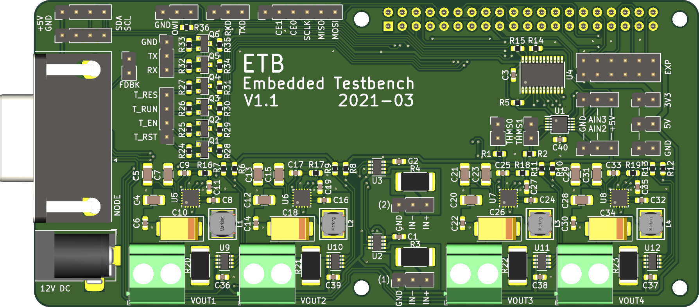

# ETB - PCB Design

The board was designed with KiCad `version 5.1.9` and mainly uses schematic symbols and PCB footprints available in the [KiCad libraries](https://kicad.org/libraries/download/).
Parts not included in these libraries are available as project-specific libraries (see below).
The design requires only a two-layer PCB with all components (except the Raspberry Pi header) placed on the top side.
Also, it has enough ground zone area to avoid heating or EMI issues.


## Contents

```
kicad/
├── components                      : hierarchical schematic components
│   ├── ina219.sch                  : INA219-based wattmeter
│   ├── mic24045.sch                : MIC24045-based DC/DC converter
│   ├── shifter_2.sch               : MOSFET-based bi-directional level shifter (2 channel)
│   └── shifter_4.sch               : MOSFET-based bi-directional level shifter (4 channel)
├── myfootprint.pretty              : custom PCB footprints
│   ├── FQFN33-20LD-PL-1.kicad_mod  : FQFN33 footprint for MIC24045
│   └── L_Bourns-SRN5040.kicad_mod  : Bourns SRN5040 inductor footprint
├── embedded_testbench.kicad_pcb    : PCB layout file
├── embedded_testbench.lib          : schematic symbols library file
├── embedded_testbench.ods          : BOM (created with LibreOffice Calc version 7.1.1.2)
├── embedded_testbench.pro          : KiCad project file
├── embedded_testbench.sch          : schematic layout file
├── fp-lib-table                    : project-specific footprint library list
├── mycomponents.dcm                : custom schematic library (descriptions, aliases and keywords)
├── mycomponents.lib                : custom schematic library
└── sym-lib-table                   : project-specific symbol library list
```

## Costs

For the bill of materials (BOM) provided in the `.ods` file links to suitable components available at [Farnell](https://www.farnell.com/) are given including the prices valid at the time of the development (2021-03).
The cost of one *ETB* was around 53€ for the components ([Farnell](https://www.farnell.com/)) and around 15€ for the PCB ([PCB Pool / Beta Layout](https://eu.beta-layout.com/pcb/)).
Thus, the total costs of one *ETB* are below **70€**.
Depending on the supplier and quantities ordered, the costs may vary.


## Schematic

**Main schematic**:  


**Embedded hierarchical schematics**:  
* MIC24045 Schematic ([#1](../media/schematic/embedded_testbench-mic1.svg),[#2](../media/schematic/embedded_testbench-mic2.svg),[#3](../media/schematic/embedded_testbench-mic3.svg),[#4](../media/schematic/embedded_testbench-mic4.svg))  
* INA219 Schematic ([#1](../media/schematic/embedded_testbench-ina1.svg),[#2](../media/schematic/embedded_testbench-ina2.svg),[#3](../media/schematic/embedded_testbench-ina3.svg),[#4](../media/schematic/embedded_testbench-ina4.svg))  
* [CTRL shifter Schematic](../media/schematic/embedded_testbench-shifter_ctrl.svg)  
* [UART shifter Schematic](../media/schematic/embedded_testbench-shifter_uart.svg)  


## PCB Design

Front:  


Back:  


For the PCB design the following rules were used:
* Design rules:
    * Minimum track width: `0.15 mm`
    * Minimum via diameter: `0.6 mm`
    * Minimum via drill: `0.3 mm`
    * Minimum hole to hole: `0.25 mm`
    * `Prohibit overlapping courtyards`
* Tracks:
    * `0.2 mm`
    * `0.25 mm`
    * `0.4 mm`
    * `0.8 mm`
* Vias:
    * Size: `0.6 mm`
    * Drill: `0.3 mm`
* Zones:
    * Clearance: `0.3 mm`
    * Minimum width: `0.18 mm`
    * Pad connections: `Thermal reliefs`
    * Thermal clearance: `0.18 mm`
    * Thermal spoke width: `0.8 mm`


## Components and Libraries

| Reference | Value | Symbol Library | Symbol | Footprint Library | Footprint |
|-----------|-------|----------------|--------|-------------------|-----------|
| C9,C17,C25,C33 | 47pF | Device | C | Capacitor_SMD | C_0603_1608Metric |
| C11,C19,C27,C35 | 10nF | Device | C | Capacitor_SMD | C_0603_1608Metric |
| C1-C3,C6,C8,C14,C16,C22,C24,C30,C32,C36-C40 | 100nF | Device | C | Capacitor_SMD | C_0603_1608Metric |
| C5,C7,C13,C15,C21,C23,C29,C31 | 2.2uF | Device | C | Capacitor_SMD | C_1206_3216Metric |
| C4,C12,C20,C28 | 22uF | Device | C | Capacitor_SMD | C_1206_3216Metric |
| C10,C18,C26,C34 | 100uF | Device | CP1 | Capacitor_Tantalum_SMD | CP_EIA-7343-31_Kemet-D |
| L1-L4 | 2.2uH | Device | L | *myfootprint*`*` | L_Bourns-SRN5040 |
| R3,R4,R20-R23 | 0.1ohm | Device | R | Resistor_SMD | R_2512_6332Metric |
| R16-R19 | 2.7kohm | Device | R | Resistor_SMD | R_0603_1608Metric |
| R1,R2,R5-R15,R24-R36 | 10kohm | Device | R | Resistor_SMD | R_0603_1608Metric |
| Q1-Q6 | BSS138 | Transistor_FET | BSS138 | Package_TO_SOT_SMD | SOT-23 |
| U1 | ADS1115IDGS | Analog_ADC | DS1115IDGS | Package_SO | TSSOP-10_3x3mm_P0.5mm |
| U2,U3,U9-U12 | INA219 | *mycomponents*`*` | INA219 | Package_TO_SOT_SMD | SOT-23-8 |
| U4 | TCA9548APW | Interface_Expansion | TCA9548APWR | Package_SO | TSSOP-24_4.4x7.8mm_P0.65mm |
| U5-U8 | MIC24045 | *mycomponents*`*` | MIC24045 | *myfootprint*`*` | FQFN33-20LD-PL-1 |
| J1 | - | Connector | Barrel_Jack_Switch | Connector_BarrelJack | BarrelJack_Horizontal |
| J4,J7,J8,J10 | - | Connector_Generic | Conn_01x02 | TerminalBlock_Philmore | TerminalBlock_Philmore_TB132_1x02_P5.00mm_Horizontal |
| J2-J3,J13-J15,J22 | - | Connector_Generic | Conn_01x02 | Connector_PinHeader_2.54mm | PinHeader_1x02_P2.54mm_Vertical |
| J5,J9,J11,J16-J19 | - | Connector_Generic | Conn_01x03 | Connector_PinHeader_2.54mm | PinHeader_1x03_P2.54mm_Vertical |
| J6,J20-J21 | - | Connector_Generic | Conn_01x04 | Connector_PinHeader_2.54mm | PinHeader_1x04_P2.54mm_Vertical |
| J12 | - | Connector_Generic | Conn_01x06 | Connector_PinHeader_2.54mm | PinHeader_1x06_P2.54mm_Vertical |
| J23 | - | Connector_Generic | Conn_02x06_Counter_Clockwise | Connector_PinHeader_2.54mm | PinHeader_2x06_P2.54mm_Vertical |
| P1 | - | Connector_Generic | Conn_02x20_Odd_Even | Connector_PinHeader_2.54mm | PinHeader_2x20_P2.54mm_Vertical |
| J24 | - | Connector | DB15_Female_HighDensity_MountingHoles | Connector_Dsub | DSUB-15-HD_Female_Horizontal_P2.29x1.98mm_EdgePinOffset8.35mm_Housed_MountingHolesOffset10.89mm |
| MK1-MK4 | - | Mechanical | MountingHole | MountingHole | MountingHole_2.7mm_M2.5 |


If your installation of KiCad is missing (some of) the standard libraries, you can download them from [KiCad libraries](https://kicad.org/libraries/download/).
The custom libraries required (marked with `*`) are all contained in this repository.
